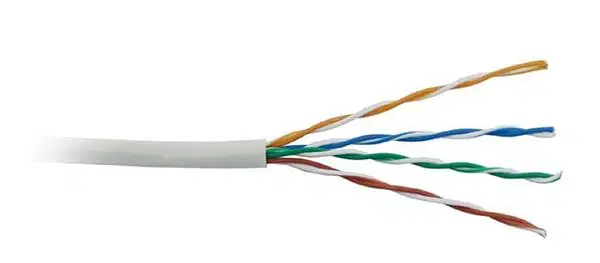

## 1. DASAR TEORI
Media jaringan adalah perangkat keras yang digunakan untuk membangun sebuah komputer baik itu perangkat keras maupun perangkat lunak. Disini untuk dapat membangun sebuah media jaringan diperlukan minimal dua buah komputer, kartu jaringan atau Network Interface Card dan perangkat keras jaringan lain seperti switch, hub, router, file server, repeater, bridge dan media transmisi.
### 1.1 MEDIA JARIANGAN KOMPUTER
  Jenis-jenis media transmisi jaringan yang paling umum digunakan diantaranya :  
  1. Kabel LAN  
   
   
   
  2. Fiber optik (serat optik)   
   
   
   
  3. Kabel tembaga   
  4. Radio Frequency (jaringan nirkabel) 
   
   
   

  Namun yang paling sering kita jumpai adalah kabel LAN untuk memnghubungan komputer satu dengan komputer lainnya dalam lingkup yang kecil. Kabel LAN terbagi menjadi dua yaitu :
  - Unshield Twisted Pair (UTP)
   
   
   
  - Shield Twisted Pair (STP)
   
   
   

### 1.2 STANDARISASI KABEL UTP
- Cat 1 digunakan untuk koneksi sambungan telepon)
- Cat 2 digunakan untuk protokol localtalk Apple) dengan kecepatan data hingga 4 Mbps)
- Cat 3 digunakan untuk protokol ethernet dengan kecepatan data hingga 10 Mbps)
- Cat 4 digunakan untuk protokol 16 Mbps token ring IBM) dengan kecepatan data hingga 20 Mbps)
- Cat 5 digunakan untuk protokol fast ethernet dengan kecepatan data hingga 100 Mbps)
- Cat 5e digunakan untuk protokol fast ethernet dengan kecepatan data hingga 250 Mbps)
- Cat 6 digunakan untuk protokol fast ethernet dengan kecepatan data hingga 10 GB/s

### 1.3 Koneksi Dengan Kabel UTP
Dalam penggunaan kabel UTP untuk jaringan LAN, ada 2 cara pemasangan kabel UTP :
 
 
 
 
### Straight-through  (Lurus)
Kabel straight-through digunakan untuk membuat koneksi antara berbagai perangkat. Misalnya, komputer dengan hub, komputer dengan sakelar, sakelar dengan router, router dengan hub, dll.
Fungsi-Fungsi lain diantaranya :  

- Sebagai penghubung antara komputer dengan switch
- Sebagai penghubung komputer dengan LAN pada modem cable/DSL
- Sebagai penghubung router dengan LAN pada modem cable/DSL
- Sebagai penghubung antara switch ke router
- Sebagai penghubung antara hub ke router.
 
###  Cross-over (Lurus)
Kabel cross atau kabel crossover merupakan jenis kabel yang digunakan untuk menghubungkan suatu perangkat dengan jaringan secara peer to peer atau point to point. Fungsi-Fungsi lain diantaranya :  

- Sebagai penghubung 2 komputer
- Sebagai penghubung 2 buah switch
- Sebagai penghubung 2 buah hub
- Sebagai penghubung switch dengan hub
- Sebagai penghubung komputer dengan router.

## 2. Pembuatan Kabel UTP
Cara pembuatan kabel UTP yang dapat digunakan untuk membuat jaringan LAN, adalah dengan menghubungkan kabel UTP dengan konektro RJ45, hal ini biasa di sebut dengan crimping.

### 2.1 Alat yang Perlu dipersiapkan dan Kegunaannya 
- Kabel UTP (Secukupnya)
   
   
   
   
  Kabel UTP yang menjadi media penghubung jaringan internet ini akan disambungkan dengan konektor RJ45, di dalam kabel UTP terdiri dari 8 helai kabel tipis yang berwarna-warni
- Tank Crimping 
   
   
   
   
  Digunakan untuk menyambungkan kabel UTP dengan konektor RJ45
- Konektor RJ45
   
   
   
   
  Konektor RJ45 akan disambungkan dengan kabel UTP, lalu ditancapkan ke masing-masing port ethernet setiap komputer sehingga bisa membentuk sebuah jaringan
- LAN Tester
   
   
   
   
  Adalah alat yang digunakan apakah kabel yang telah kita crimping terpasang dengan benar atau tidak

### 2.2 Langkah - Langkah Pembuatan Kabel Straight
  #### 1. Kupas kabel UTP kira-kira 2cm pada ujung salah satu kabel utp menggunakan pisau yang ada pada tank crimping atau jika tidak ada bisa menggunakan gunting.
   

  #### 2. Potong kabel milein (jika ada), sesuaikan urutan warna kabel sesuai gambar di bawah ini, urutan kabelnya yaitu : 
    #1 putih oren
    #2 Oren
    #3 Putih Hijau
    #4 Biru
    #5 Putih Biru 
    #6 Hijau
    #7 Putih Coklat
    #8 Coklat

   

  ####
#### 3. Lalu, luruskan kabel dan gunting bagian kabel supaya rata,
   

  ####
#### 4. Masukan kabel yang telah di urutkan warnanya dan yg telah diratakan panjangnya, kedalam konektor RJ45. Seperti foto dibawah ini. Pastikan kabel luar (warna abu-abu) ikut masuk kedalam RJ45 supaya ketika dicrimping kuat dan tidak mudah lepas
   

  ####
#### 5. Lakukan crimping dengan tank crimping. Pastikan bahwa saat crimping kabel tidak boleh kendor sehingga crimping kuat dan tidak mudah lepas. Lalu crimping kabel, tekan hingga terdengar bunyi "klek", itu artinya RJ45 sudah mengunci kabel UTP
   

  ####
#### 6. Lakukan langkah 1 s/d 5 pada ujung kabel UTP lainnya.

### 2.3 Langkah - Langkah Pembuatan Kabel Cross-over
  #### 1. Kupas kabel UTP kira-kira 2cm pada ujung salah satu kabel utp menggunakan pisau yang ada pada tank crimping atau jika tidak ada bisa menggunakan gunting.
   

  #### 2. Potong kabel milein (jika ada), sesuaikan urutan warna kabel sesuai gambar di bawah ini, urutan kabelnya yaitu : 
    #1 Putih oren
    #2 Oren
    #3 Putih Hijau
    #4 Biru
    #5 Putih Biru 
    #6 Hijau
    #7 Putih Coklat
    #8 Coklat

   

  #### 3. Lalu, luruskan kabel dan gunting bagian kabel supaya rata,
   

  #### 4. Masukan kabel yang telah di urutkan warnanya dan yg telah diratakan panjangnya, kedalam konektor RJ45. Seperti foto dibawah ini. Pastikan kabel luar (warna abu-abu) ikut masuk kedalam RJ45 supaya ketika dicrimping kuat dan tidak mudah lepas
   

  #### 5. Lakukan crimping dengan tank crimping. Pastikan bahwa saat crimping kabel tidak boleh kendor sehingga crimping kuat dan tidak mudah lepas. Lalu crimping kabel, tekan hingga terdengar bunyi "klek", itu artinya RJ45 sudah mengunci kabel UTP
   

  #### 6. Lakukan langkah 1 kembali pada ujung kabel yang lain, selanjutnya lakukan seperti pada langkah ke 2 namun dengan urutan kabel : 
    #1 Putih Hijau
    #2 Hijau
    #3 Putih Oren
    #4 Biru
    #5 Putih Biru 
    #6 Oren
    #7 Putih Coklat
    #8 Coklat

  #### 7. Lakukan langkah ke 3 s/d 5

## 3. Pengetesan Kabel UTP
Pengetesan kabel UTP bertujuan untuk melihat apakah kabel UTP telah dicrimping dengan baik dan bisa digunakan atau tidak.
### 3.1 Alat Pengetesan
Cara pengetesan kabel UTP adalah dengan menggunakan LAN tester, dengan menancapkan kabel 2 ujung kabel UTP ke 2 port yang ada pada LAN tester, lalu kita melihat lampu indikator dari LAN tester. jika ada salah satu lampu yang tidak hidup berarti kemungkinan ada indikasi kesalahan saat mengcrimping kabel UTP
 
 
 

### 3.2 Cara Pengetesan
#### A. Straight through
##### 1. Hubungankan 2 ujung kabel UTP ke 2 port yang pada LAN tester
 

##### 2. Nyalakan LAN tester
##### 3. Perhatikan indikator LAN testerr

##### 4. Pastikan setiap baris nomor lampu indikator menyala bersamaan
 

#### B. Crosss-over
#### 1. Hubungankan 2 ujung kabel UTP ke 2 port yang pada LAN tester
 

##### 2. Nyalakan LAN tester
##### 3. Perhatikan indikator LAN testerr

##### 4. Pastikan setiap baris bahwa:
  - Indikator baris Lampu Nomor 1 menyala dengan kampu nomor 3 (Indikator lampu lain)
  - Indikator baris Lampu Nomor 2 menyala dengan kampu nomor 6 (Indikator lampu lain)
  - Indikator baris Lampu Nomor 3 menyala dengan kampu nomor 1 (Indikator lampu lain)
  - Indikator baris Lampu Nomor 4 menyala dengan kampu nomor 4 (Indikator lampu lain)
  - Indikator baris Lampu Nomor 5 menyala dengan kampu nomor 5 (Indikator lampu lain)
  - Indikator baris Lampu Nomor 6 menyala dengan kampu nomor 2 (Indikator lampu lain)
  - Indikator baris Lampu Nomor 7 menyala dengan kampu nomor 7 (Indikator lampu lain)
  - Indikator baris Lampu Nomor 8 menyala dengan kampu nomor 8 (Indikator lampu lain)
 

