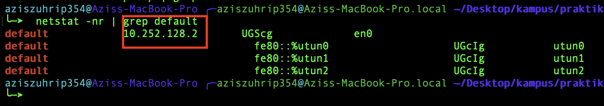

## CATATAN PRAKTIKUM MENGGUNAKAN WIRESHARK

Wireshark adalah tool network analyzer yang dapat penganalisis paket bebas dan sumber terbuka. Perangkat ini digunakan untuk pemecahan masalah jaringan, analisis, perangkat lunak dan pengembangan protokol komunikasi, dan pendidikan. Awalnya bernama Ethereal, pada Mei 2006 proyek ini berganti nama menjadi Wireshark karena masalah merek dagang

### PENGERTIAN COLOR RULES PADA WIRESHARK
Label warna pada wireshark berguna untuk mengidentifikasi jenis protokol jaringan apa yang ter-capture secara sekilas. Berikut adalah default color rules pada wireshark
 
 

 
Secara default, label warna hitam menandakan paket TCP yang yang bermasalah seperti lost packet , label warna hijau menandakan lalu lintas TCP, label warna biru muda menandakan lalu lintas UDP
 
<table width="100%" border="2" cellpadding="0" style="border-collapse: collapse;">
   <tr style="border: 2px solid black"> 
        <td style="text-align: center; font-weight:bold ">
            LABEL WARNA
        </td>
        <td style="text-align: center; font-weight:bold ">
            TIPE PAKET
        </td>
   </tr>
   <tr style="border: 2px solid black"> 
        <td style="text-align: center">
            Light Purple	
        </td>
        <td style="text-align: center">
            TCP 
        </td>
   </tr>
   <tr style="border: 2px solid black"> 
        <td style="text-align: center">
            Light Blue	
        </td>
        <td style="text-align: center">
            UDP
        </td>
   </tr>
   <tr style="border: 2px solid black"> 
        <td style="text-align: center">
            Black
        </td>
        <td style="text-align: center">
            Packets with errors
        </td>
   </tr>
   <tr style="border: 2px solid black"> 
        <td style="text-align: center">
            Light Green	
        </td>
        <td style="text-align: center">
            HTTP Traffic
        </td>
   </tr>
   <tr style="border: 2px solid black"> 
        <td style="text-align: center">
            Light Yellow	
        </td>
        <td style="text-align: center">
            Windows-specific traffic, including Server Message Blocks (SMB) and NetBIOS
        </td>
   </tr>
   <tr style="border: 2px solid black"> 
        <td style="text-align: center">
            Dark Yellow	
        </td>
        <td style="text-align: center">
            Routing
        </td>
   </tr>
   <tr style="border: 2px solid black"> 
        <td style="text-align: center">
            Dark Gray
        </td>
        <td style="text-align: center">
            TCP SYN, FIN and ACK traffic
        </td>
   </tr>
   <tr style="border: 2px solid black"> 
        <td style="text-align: center">
            Red
        </td>
        <td style="text-align: center">
            Invalid Display Filter
        </td>
   </tr>
   <tr style="border: 2px solid black"> 
        <td style="text-align: center">
            Black Color	
        </td>
        <td style="text-align: center">
        </td>
   </tr>
</table>

## MENCOBA METRACKING JALUR ICMP (PACKET ANALYZER)

### - MENGECHECK IP ADDRESS LAPTOP 
  
 
 
Pada tahap ini, saya melakukan pengecekan terhadap ip dari laptop saya sendiri dan untuk mengetahui network dari jaringan yang terhubung ke laptop saya

### - MENGECHECK DEFAULT GATEWAY 

 
 
Pada tahap ini, saya mencari tahu ip yang menjadi default gateway pada jaringan saya , sebelum saya melakukan ping

### - MELAKUKAN PING KE DEFAULT GATEWAY

 
 
Pada tahap ini, saya telah melakukan ping sebanyak 5 kali dari komputer (10.252.135.172) ke ip yang menjadi default gateway di jaringan saya (10.252.128.2). Proses ping berhasil dengan mendapat balasan dari ip default gateway

### - MELIHAT LALU LINTAS JARINGAN PADA WIRESHART DAN MELAKUKAN FILTER UNTUK PROTOKOL ICMP SAJA PADA WIRESHARK

 
 
Note: Disini kita telah melakukan ping ke default gateway sebanyak 5 kali, dan terekam di wireshark. Lalu terlihat bahwa proses ping request yang dilakukan oleh komputer saya (10.252.135.172) lalu dibalas oleh default gateway 10.252.128.2 (ping reply) sebanyak 5 kali juga.

### - MELIHAT ISI HEADER DARI ICMP 

- VERSION 4: Artinya lalu lintas menggunakan IPv4
- Headear Lenght : Artinya panjang header IP 20 bytes
- Protocol ICMP : Artinya protokol jaringan yang digunakan adalah ICMP
- Src: 10.252.135.172 , Dst: 10.252.128.2 : Artinya saya melakukan request ping dari 10.252.135.172 (local komputer saya) ke default gateway (10.252.128.2)

### - PEMETAAN HEADER DARI ICMP

 
 
Terlihat pada tabel pemetaan header ICMP, ketika terjadinya echo ping request tersebut, icmp bertype 8 dan codenya 0, dengan algoritma checksum 0xb036.

## KESIMPULAN 
Internet Control Message Protocol (ICMP) adalah salah satu protokol inti dari keluarga protokol internet. ICMP utamanya digunakan oleh sistem operasi komputer jaringan untuk mengirim pesan kesalahan yang menyatakan, sebagai contoh, bahwa komputer tujuan tidak bisa dijangkau.

ICMP berbeda tujuan dengan TCP dan UDP dalam hal ICMP tidak digunakan secara langsung oleh aplikasi jaringan milik pengguna. salah satu pengecualian adalah aplikasi ping yang mengirim pesan ICMP Echo Request (dan menerima Echo Reply) untuk menentukan apakah komputer tujuan dapat dijangkau dan berapa lama paket yang dikirimkan dibalas oleh komputer tujuan.

