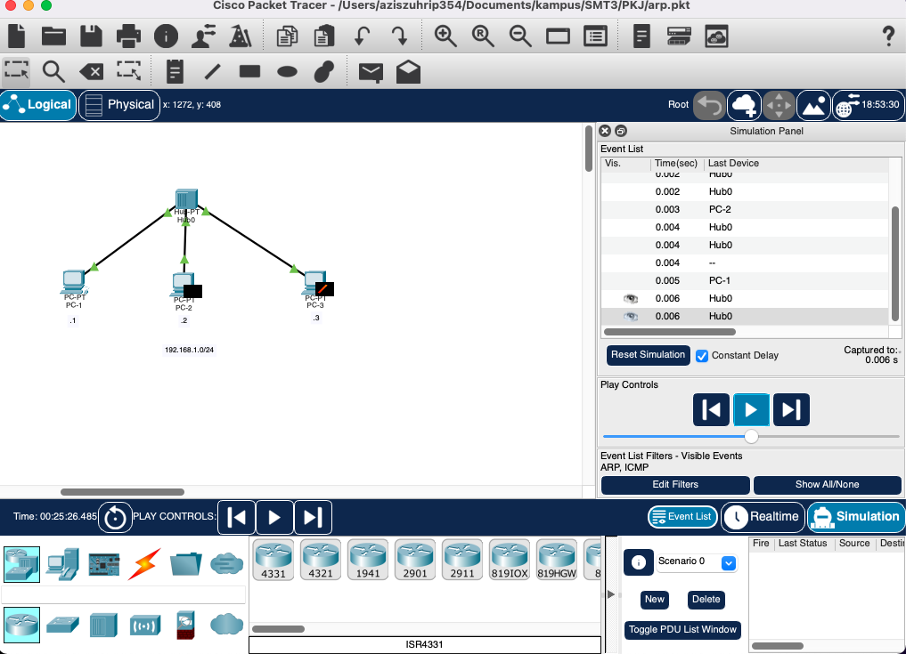

## PRAKTIKUM MENGANALISIS KONSEP ADDRESS RESOLUTION PROTOCOL (ARP)
Pada praktikum kali ini kita akan menganalisis konsep protokol Address Resolution Protocol dengan menggunakan Cisco Packet Tracer

Disini saya membuat topology sebagai berikut :
 
 

 
 
3 pc yang yang dihubungkan dengan HUB dan memiliki subnet 192.168.1.0/24

Keterangan ip address:

- PC 1 : 192.168.1.1
- PC 2 : 192.168.1.2
- PC 3 : 192.168.1.3

### Skenario 1 : PC 1 Ping ke PC 2

- Check ARP Session pada PC 1
 
 

 
 
ARP Session pada PC 1 masih kosong menandakan belum adanya proses komunikasi yang dilakukan oleh PC 1 ke PC lainnya
 
 

Untuk memudahkan kita dalam melakukan tracing pada alur paket ping (ICMP) kita harus menggunakan mode simulation
 
 

Pilih edit filter untuk melihat alur paket dari ICMP saja

- Melakukan Ping dari PC 1 ke PC 2

Terlihat pada tanda lingkaran di kanan terdapat 2 paket yang mana paket yang berwarna hijau itu adalah Destination broadcast (MAC Address) untuk mencari destination MAC Address yang dibutuhkan untuk melakukan ping (PACKET ICMP) pada layer 2.
    Sedangkan paket yang berwarna hitam adalah paket ICMP (ping) yang dihold sementara sampai proses broadcast ARP mengetahui Destination MAC address yang dituju (MAC Address dari ip 192.168.1.2)
 
 

Terlihat didalam paket broadcast destination terdapat destination MAC Address FFFF.FFFF.FFFF yang menandakan MAC Address yang khusus untuk melakukan brodcast 
 
 

Terlihat bahwa didalam paket ICMP masih di step layer 3, menunggu proses dari destination broadcast untuk mendapatkan MAC Address tujuan yaitu dari PC 2 (192.168.1.2)

- Jalankan Simulasi Alur Packet
 

 
1. pertama paket broadcast dikirimkan ke hub
 

 
2. Lalu hub akan meneruskan ke PC 2 dan PC 3
 

 
3. Namun karena PC 2 yang ingin dituju, maka hanya PC 2 yang mengirimkan respon balik ke HUB
 
 

 
 
4. Dan HUB meneruskan kembali ke PC 1 dan PC 3, namun PC 3 membuang packet tersebut karena paket tersebut bukan untuk PC 3 namun PC 1
 
 

 
 
Karena PC 1 telah mendapatkan response dari PC 2 , maka PC 1 telah mendapatkan MAC Address dari PC 2 , dan telah dapat mengirimkan paket ICMP Request (ping)
 
 

 
 
Paket ICMP di kirimkan ke HUB dan diteruskan ke PC 2 dan PC 3, namun PC 3 membuang paket tersebut karena bukan di tujukan untuk PC 3 
 
 

 
 
Lalu PC 2 mengirimkan response ICMP reply balik ke HUB, dan diteruskan ke PC 1
 
 

 
 
Ping telah berhasil dilakukan
 
- Melihat ARP Session pada PC 1

Terlihat PC 1 telah mendapatkan alamat MAC Address dari PC 2 di ARP Session

### Skenario 2 : PC 1 Ping ke PC 2 (Kembali)

 
 
Karena PC 1 Telah mendapatkan MAC Address (yang dibuktikan dengan adanya MAC Address PC 2 di ARP Session di PC 1) dari PC 2 maka untuk mengirimkan paket ICMP (PING) kita tidak perlu melakukan destination broadcast lagi
 
 

Lalu PC 2 mengirimkan response ICMP reply seperti di skenario 1 tadi
 
 

### Skenario 3 : PC 2 Ping ke PC 1

 
 
Karena PC 2 telah berkomunikasi pada PC 1 pada skenario 1 dan 2 maka PC 2 telah mendapatkan MAC Address dari PC 1 dan tidak perlu melakukan destination broadcast lagi
 
 

 
 
Lalu paket dirikimkan lewat perantara HUB
 
 

 
 
Dan pake paket ICMP di response balik oleh PC 1 dan diterima oleh PC 2 kembali
 
 
