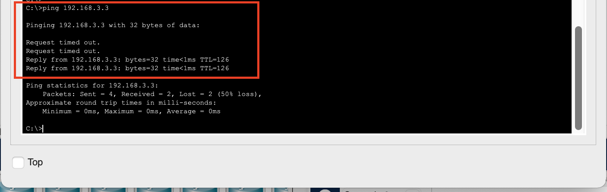

## PRAKTIKUM ROUTING STATIC
Pada praktikum kali kita akan melakukan routing static yang menghubungkan antara 2 network

Dan topologynya sebagai berikut :
 
 

 
 

Keterangan ip address:

- PC 1 : 192.168.1.2
- PC 2 : 192.168.3.3
- ROUTER-1:
  - Gig0/0/0 : 192.168.1.1
  - Gig0/0/1 : 192.168.2.1
- ROUTER-1:
  - Gig0/0/0 : 192.168.2.2
  - Gig0/0/1 : 192.168.3.2

Langkah - Langkah : 
## 1. Konfigurasi IP Address PC 1 

## 2. Konfigurasi IP Address PC 2

## 3. Konfigurasi IP di Router-1 pada interface Gig0/0/0 dan jangan lupa untuk nyalankan (on) interfacenya

## 4. Konfigurasi IP di Router-1 pada interface Gig0/0/1 dan jangan lupa untuk nyalankan (on) interfacenya

## 5. Konfigurasi IP di Router-2 pada interface Gig0/0/0 dan jangan lupa untuk nyalankan (on) interfacenya

## 6. Konfigurasi IP di Router-2 pada interface Gig0/0/1 dan jangan lupa untuk nyalankan (on) interfacenya

## 7. Lakukan routing static pada Router-1

## 8. Lakukan routing static pada Router-2

## 9. Melihat table routing di Router-1

 
 
Terlihat bahwa Router 1 telah mendapatkan informasi table dari rute ke jaringan 192.168.3.0/24
 
 

## 10. Melihat table routing di Router-2

 
 
Terlihat bahwa Router 2 telah mendapatkan informasi table dari rute ke jaringan 192.168.1.0/24
 
 

## 11. Melihat table routing di PC-1

Terlihat bahwa network destination dari PC-1 adalah 0.0.0.0 yang artinya semua paket di teruskan ke network any melalui (gateway) 192.168.1.1

## 12. Melihat table routing di PC-2

Terlihat bahwa network destination dari PC-2 adalah 0.0.0.0 yang artinya semua paket di teruskan ke network any melalui (gateway) 192.168.3.2

## 13. Melakukan test ping dari PC-1 ke PC-2

Terlihat bahwa saat pertama kali PC-1 nge ping PC-1 terjadi 2x request timeout, ini dikarenakan terjadinya 2x broadcast untuk mendapatkan mac address yang pertama dari PC-1 ke Router-1 dan dari Router-1 ke Router-2
 
 

## 14. Melakukan test ping dari PC-2 ke PC-1

 
 
Terlihat juga pada saat PC-2 melakukan ping sudah tidak terjadi request timeout lagi karena keduanya telah melakukan koneksi sebelumnya

