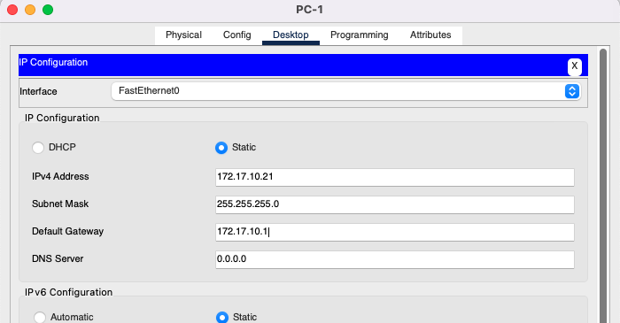
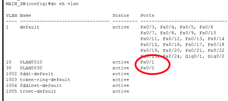

# PRAKTIKUM VLAN DAN ROUTER ON STICK
Pada praktikum kali kita akan melakukan praktikum vlan dan router on stick yang menghubungkan antara 2 network pada vlan yang berbeda

Dan topologynya sebagai berikut :
 
 

 
 

Keterangan IP Address :
- PC 1 : 172.17.10.21
- PC 2 : 172.17.30.23
- MAIN_ROUTER :
  - Gig0/0/0.10 : 172.17.10.1
  - Gig0/0/0.30 : 172.17.30.1
- MAIN_SW :
    - Vlan 10 : 172.17.10.0/24
    - Vlan 20 : 172.17.30.0/24

## Konfigurasi IP Di PC-1

## Konfigurasi IP Di PC-2

## Hidupkan interface Gig0/0/0 pada MAIN_ROUTER

## Konfigurasikan Router On Stick pada MAIN_ROUTER

 
Membuat sub interface dari Gig0/0/0.10 untuk default gateway vlan 10 dan membuat sub interface dari Gig0/0/0.30 untuk default gateway vlan 30

## Konfigurasikan Vlan 10 dan Vlan 30 pada MAIN_SW

## Mengecheck daftar vlan pada MAIN_SW

 
Terlihat vlan 10 dan vlan 30 telah terdaftar pada list vlan di MAIN_SW namun kenggotaan portnya masih kosong

## Memberikan access pada interface fa0/1 ke vlan 10 dan fa0/1 ke vlan 30 pada MAIN_SW

## Memberikan mode trunk pada interface fa0/3 yang berhubungan langsung ke MAIN_ROUTER

## Mengecheck keanggotaan port vlan 10 dan vlan 30

 
Terlihat vlan 10 memiliki port fa0/1 sebagai anggotannya, dan vlan 30 memiliki anggota port fa0/2

## Test Ping pada PC-1 ke PC-2

