# PRAKTIKUM VLAN DAN ROUTER ON STICK
Pada praktikum kali kita akan melakukan praktikum vlan dan router on stick yang menghubungkan antara 3 network pada vlan yang berbeda

Dan topologynya sebagai berikut :
 
 
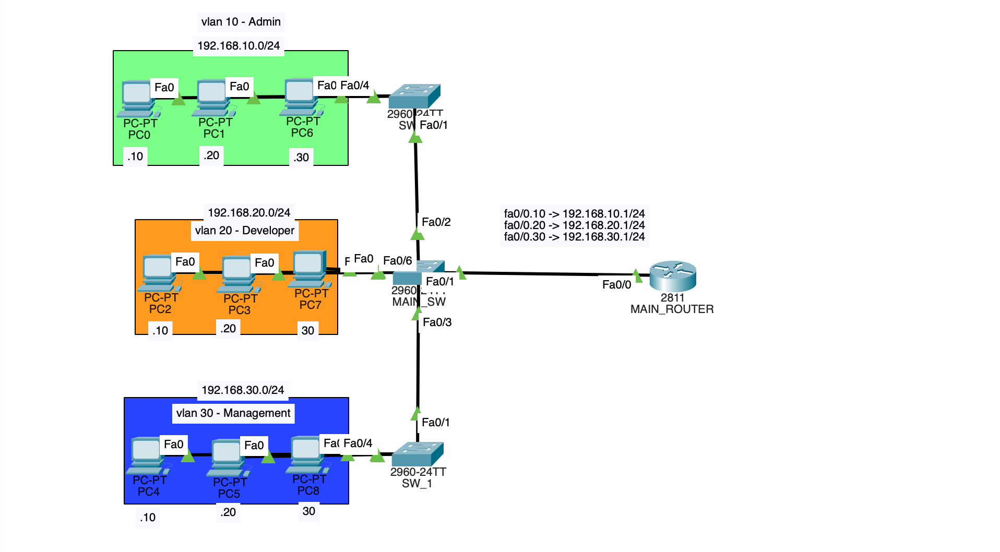
 
 

Keterangan IP Address :
- PC 0 : 192.168.10.10/24
- PC 1 : 192.168.10.20/24
- PC 2 : 192.168.20.10/24
- PC 3 : 192.168.20.20/24
- PC 4 : 192.168.30.10/24
- PC 5 : 192.168.30.20/24
- PC 6 : 192.168.10.30/24
- PC 7 : 192.168.20.30/24
- PC 8 : 192.168.30.30/24
- MAIN_ROUTER :
  - Gig0/0/0.10 : 192.168.10.1
  - Gig0/0/0.20 : 192.168.20.1
  - Gig0/0/0.30 : 192.168.30.1
- MAIN_SW :
    - Vlan 10 : 192.162.10.0/24
    - Vlan 20 : 192.162.20.0/24
    - Vlan 30 : 192.162.30.0/24

## Konfigurasi IP Di PC-0 di lantai 1

## Konfigurasi IP Di PC-1 di lantai 1

## Konfigurasi IP Di PC-6 di lantai 1

## Konfigurasi IP Di PC-2 di lantai 2

## Konfigurasi IP Di PC-3 di lantai 2
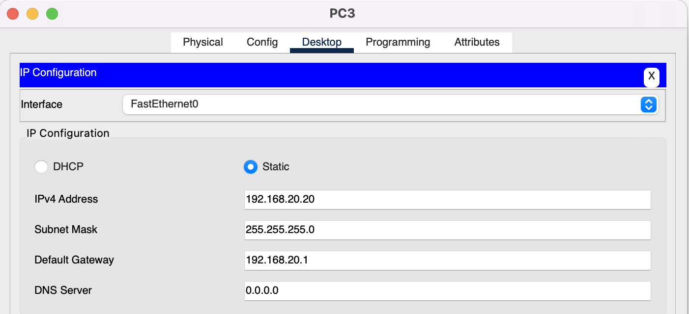

## Konfigurasi IP Di PC-7 di lantai 2

## Konfigurasi IP Di PC-4 di lantai 3
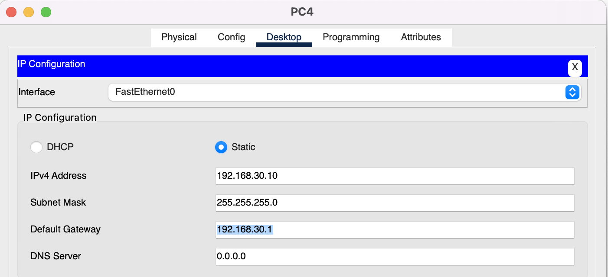

## Konfigurasi IP Di PC-5 di lantai 3

## Konfigurasi IP Di PC-8 di lantai 3

## Membuat vlan pada SW_1
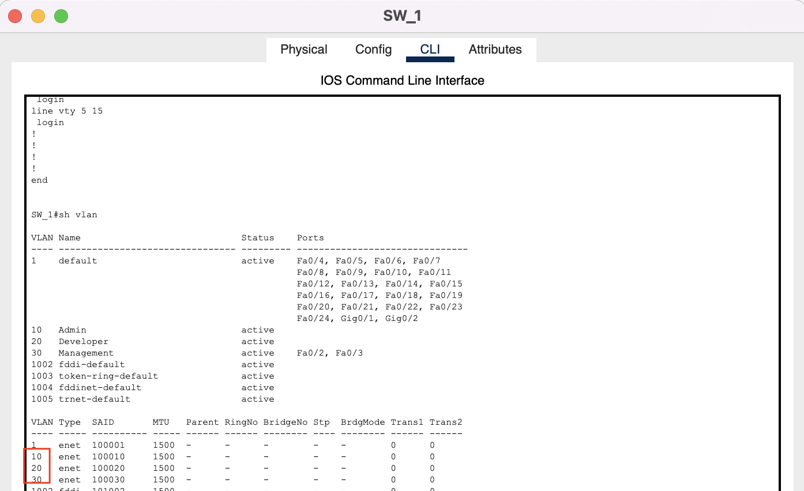

## Membuat vlan pada MAIN_SW
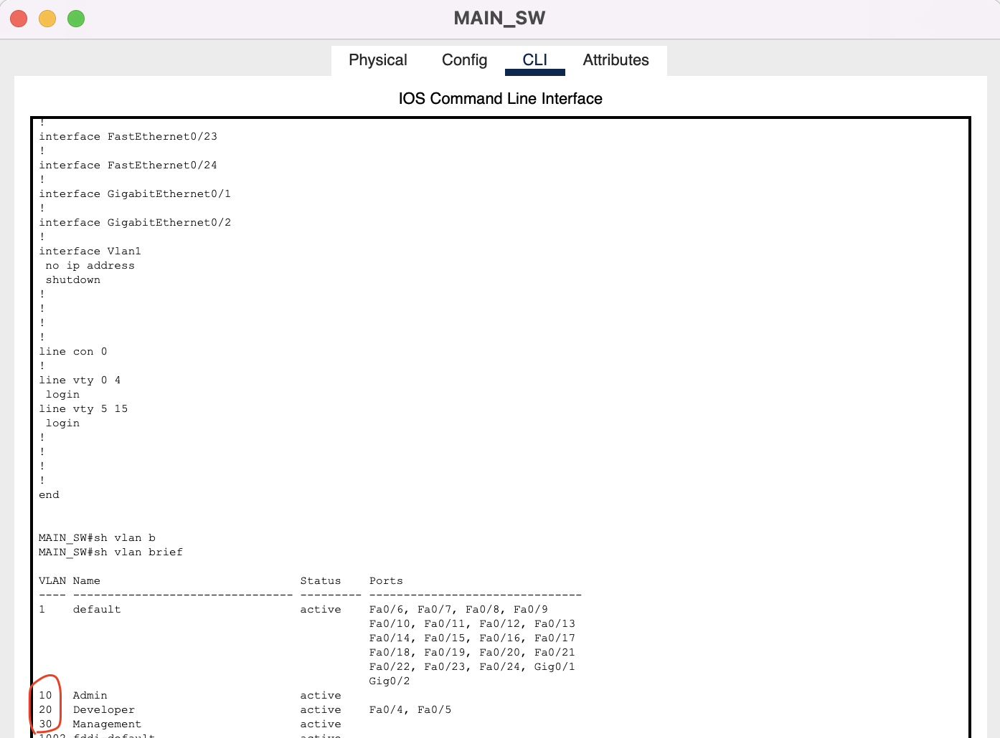

## Membuat vlan pada SW_2
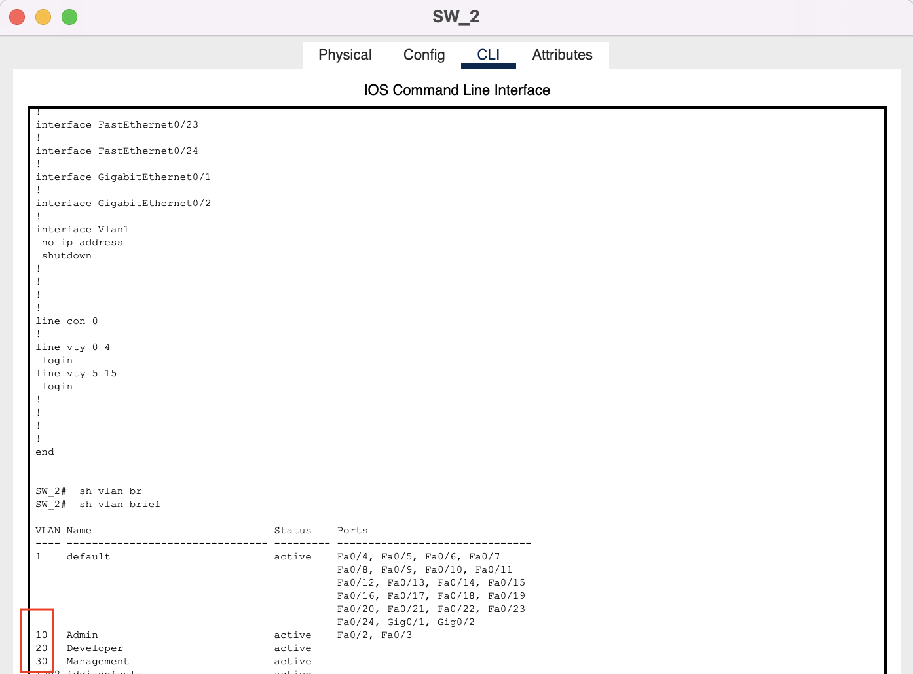

## Konfigurasi interface pada MAIN_SW
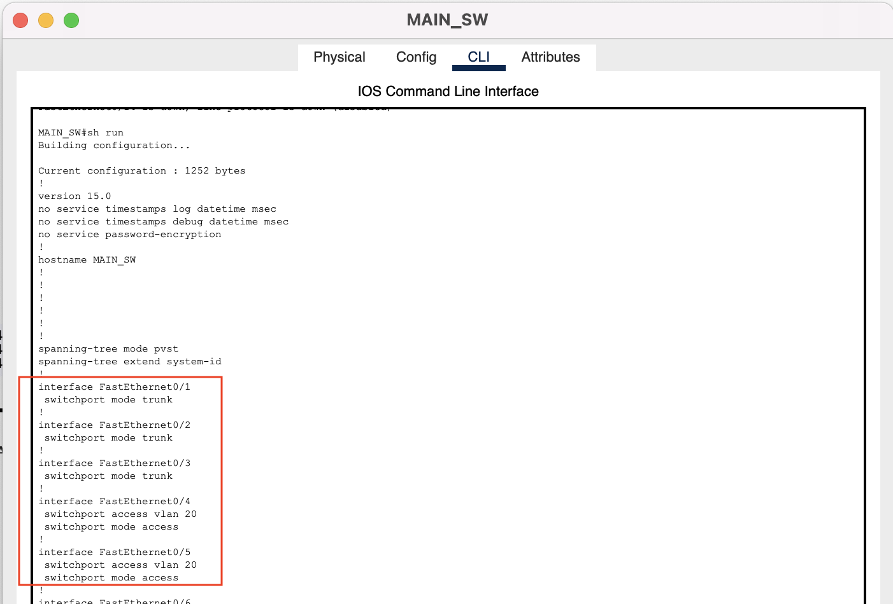

- Melakukan trunking pada interface fa0/1-fa0/3 yang mengarah ke SW_1, SW_2 dan MAIN_ROUTER
- Memberikan access pada interface fa0/4-fa0/6 untuk bisa mengakses vlan 20

## Konfigurasi interface pada SW_2
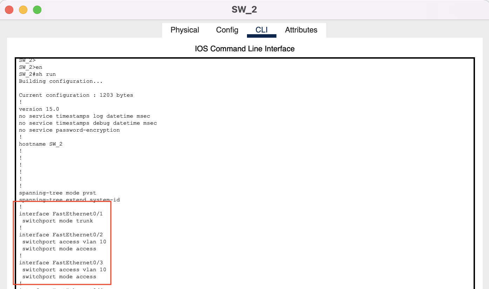

- Melakukan trunking pada interface fa0/1 yang mengarah ke MAIN_SW
- Memberikan access pada interface fa0/2-fa0/4 untuk bisa mengakses vlan 20

## Konfigurasi interface pada SW_1
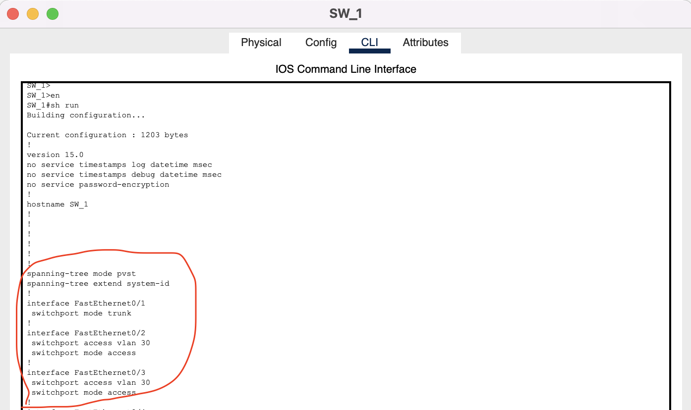

- Melakukan trunking pada interface fa0/1 yang mengarah ke MAIN_SW
- Memberikan access pada interface fa0/2-fa0/4 untuk bisa mengakses vlan 20

## Konfigurasi Router On Stick pada MAIN_ROUTER
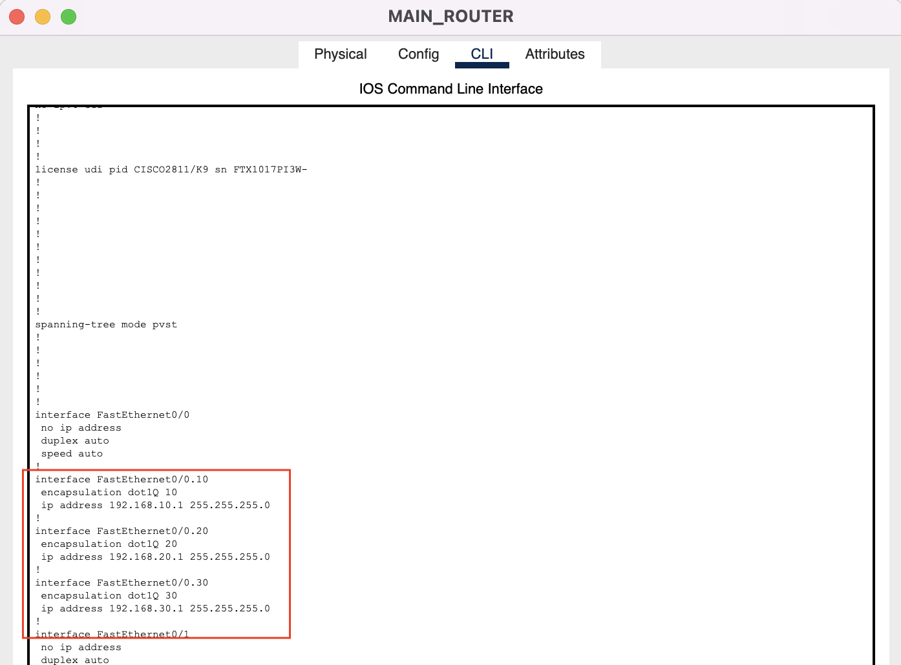

- Membuat dan mengenkapsulasi sub interface fa0/0.10 dengan ip 192.168.10.1/24 yang akan menjadi gateway untuk vlan 10
- Membuat dan mengenkapsulasi sub interface fa0/0.20 dengan ip 192.168.20.1/24 yang akan menjadi gateway untuk vlan 20
- Membuat dan mengenkapsulasi sub interface fa0/0.30 dengan ip 192.168.30.1/24 yang akan menjadi gateway untuk vlan 30

## Test Ping Dari PC-0 ke PC 2 (VLAN 10 ke VLAN 20) dan Test Ping dari PC-0 ke PC-4 (VLAN 10 ke VLAN 30)
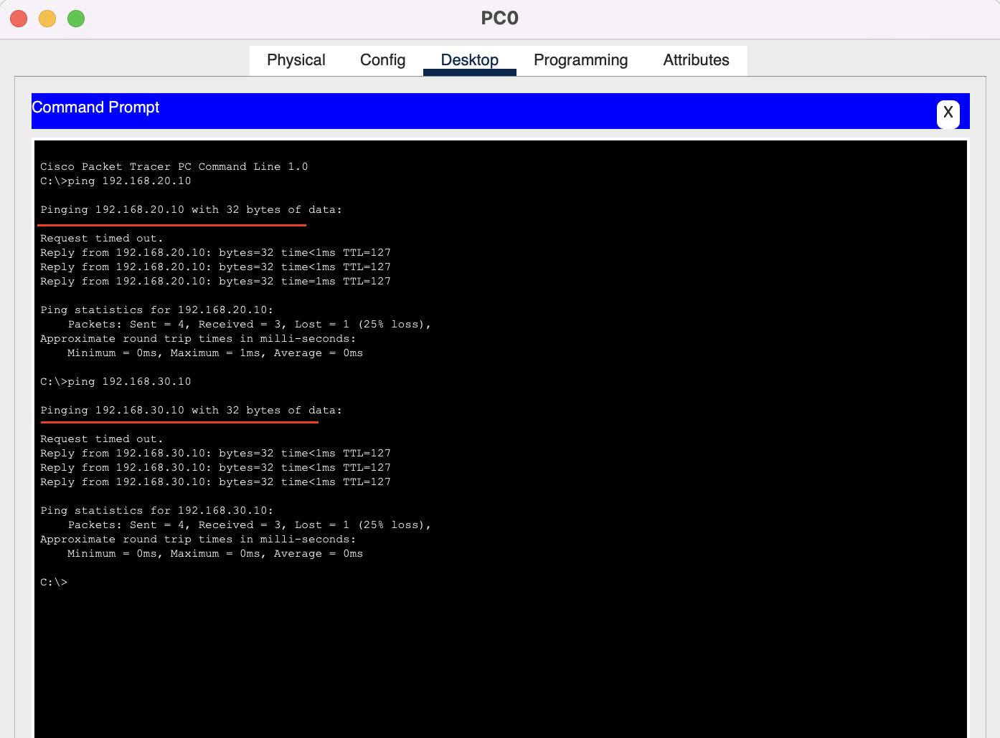

