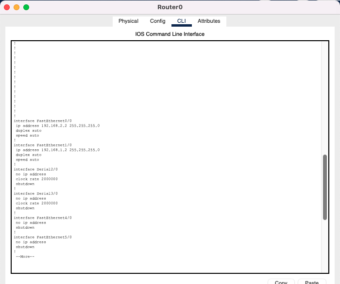

# PRAKTIKUM VLAN DAN ROUTER ON STICK
Pada praktikum kali kita akan melakukan praktikum vlan dan router on stick yang menghubungkan antara 3 network pada vlan yang berbeda

Dan topologynya sebagai berikut :
 
 

 
 

Keterangan IP Address :
- PC 0 : 192.168.4.2/24
- PC 2 : 192.168.5.2/24
- R1 :
  - fa0/0 : 192.168.1.1
  - fa1/0 : 192.168.3.2
  - fa7/0 : 192.168.5.1
- R2 :
  - fa0/0 : 192.168.2.1
  - fa1/0 : 192.168.3.1
  - fa7/0 : 192.168.4.1
- R0 :
  - fa0/0 : 192.168.2.2
  - fa1/0 : 192.168.1.2

## Konfigurasi IP Di PC-0

## Konfigurasi IP Di PC-2

## Konfigurasi IP di interface R2

## Konfigurasi IP di interface R0

## Konfigurasi IP di interface R1

## KONFIGURASI ROUTING STATIC SEMUA TABLE ROUTING METRICNYA DI SET 10

## Konfigurasi routing static di interface R2

## Konfigurasi routing static di interface R0

## Konfigurasi routing static di interface R1

## Melakukan ping dan traceroute dari PC0 ke PC2

- Terlihat packet melewati R1 dan R2 

## MENGUBAH KONFIGURASI ROUTING STATIC R2 YANG MENGARAH KE R0 METRICNYA DI SET 9 (LEBIH RENDAH)

Sebelum mengubah konfigurasi routing staticnya di hapus dahulu dengan command no ip route (destination) (netmask) (via) (metric)

## Konfigurasi routing static di interface R2

## Konfigurasi routing static di interface R0

## Konfigurasi routing static di interface R1

## Melakukan ping dan traceroute dari PC0 ke PC2

- Terlihat packet melewati R1 R0 R2 baru sampai ke tujuan ke PC 2