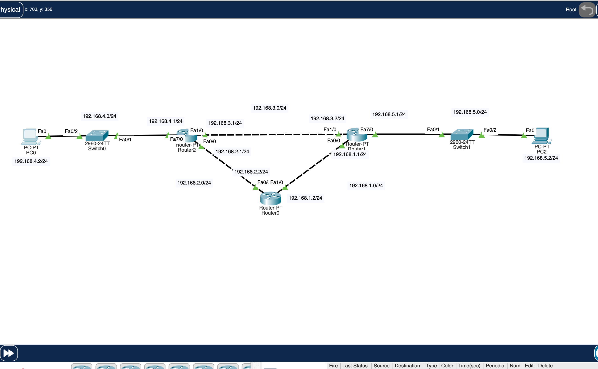
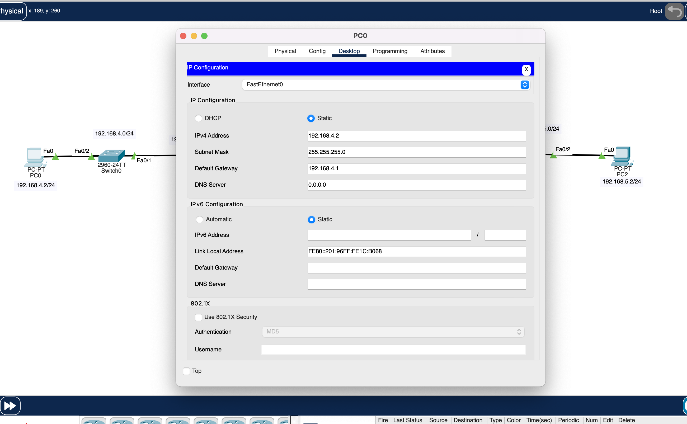
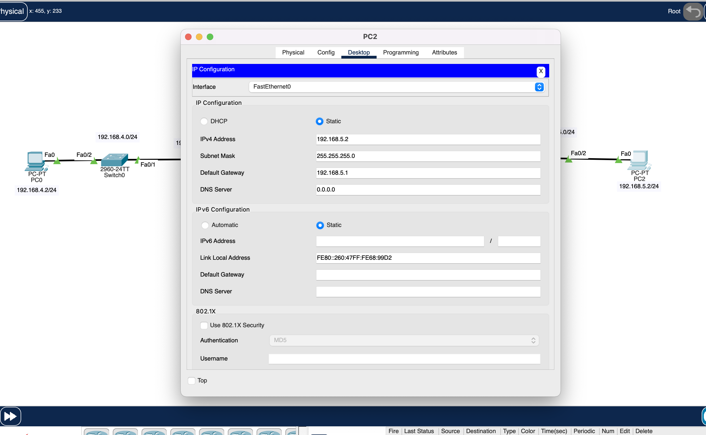
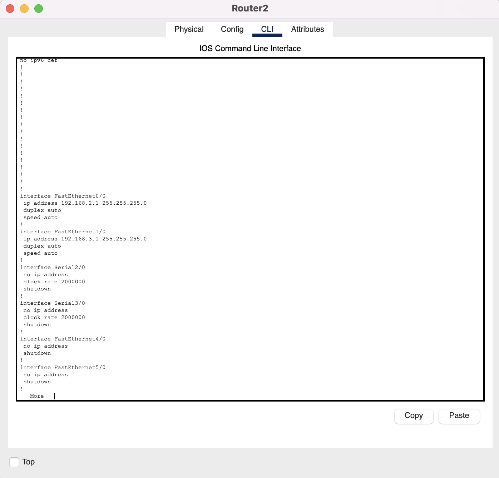
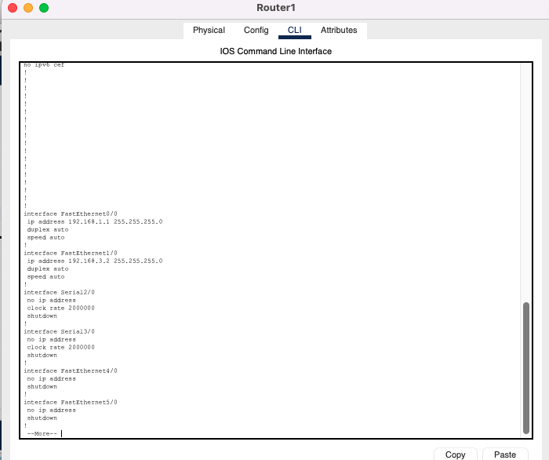

# PRAKTIKUM ROUTING DINAMIS DENGAN RIPv2
Pada praktikum kali kita akan melakukan praktikum routing dinamis dengan RIPv2 yang berjenis routing distance vektor

Dan topologynya sebagai berikut :
 
 

 
 

Keterangan IP Address :
- PC 0 : 192.168.4.2/24
- PC 2 : 192.168.5.2/24
- R1 :
  - fa0/0 : 192.168.1.1
  - fa1/0 : 192.168.3.2
  - fa7/0 : 192.168.5.1
- R2 :
  - fa0/0 : 192.168.2.1
  - fa1/0 : 192.168.3.1
  - fa7/0 : 192.168.4.1
- R0 :
  - fa0/0 : 192.168.2.2
  - fa1/0 : 192.168.1.2

## Konfigurasi IP Di PC-0

## Konfigurasi IP Di PC-2

## Konfigurasi IP di interface R2

## Konfigurasi IP di interface R0

## Konfigurasi IP di interface R1

## KONFIGURASI ROUTING RIPv2 DI SETIAP ROUTER

## Konfigurasi RIPv2 di R2

## Konfigurasi RIPv2 di R0

## Konfigurasi RIPv2 di R1

## PENGECEKAN WAKTU CONVERGENCE DI R2

## PENGECEKAN WAKTU CONVERGENCE DI R0

## PENGECEKAN WAKTU CONVERGENCE DI R1

## Melakukan ping dan traceroute dari PC0 ke PC2

- Terlihat packet melewati R1 lalu langsung R2 tanpa melewati jalur R0 dan sampai ke tujuan (ke PC 2), ini membutikan bahwa routing rip memilih jalur tercepat dengan algoritma distance vektor yang mencari jalur path next hop yang paling sedikit